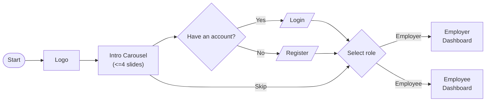

Mobile design UI scope 1 presented by @Itsnatch22 and @TheeKJ

# Welcome page
1. Logo
2. Present slides to showcase what EaziWage is about. 4-max
3. Login page and register page
4. redirect to either employer or employee

## Welcome Page Flowchart

